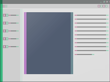

# node-process-list



*List all open processes really fast.*

## usage

```js
const process_list = require("@coalpha/process-list");

process_list().forEach(process => console.log(process.name));
```
